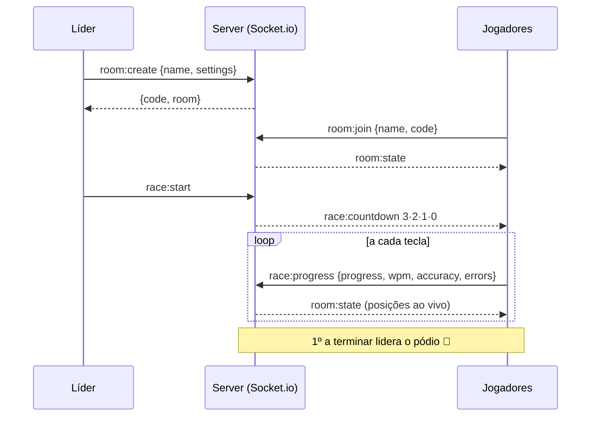
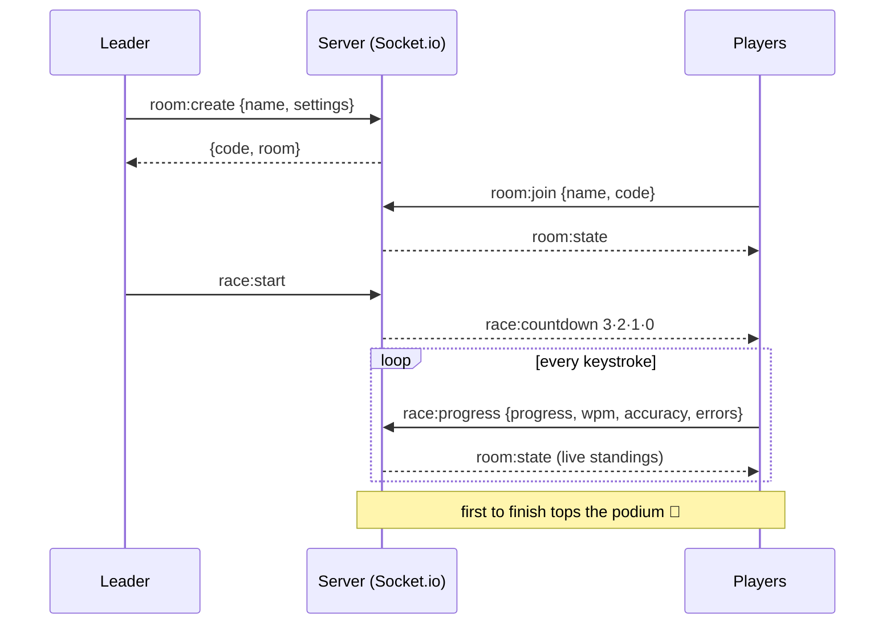

<div align="center">


# ⌨️ CodeRacer

### 🇧🇷 Corrida de digitação multiplayer para programadores — digite o código mais rápido e vença.
### 🇺🇸 Multiplayer typing race for programmers — type the code fastest and win.

<br/>

[](https://nextjs.org/)
[](https://www.typescriptlang.org/)
[](https://socket.io/)
[](https://tailwindcss.com/)
[](https://www.framer.com/motion/)

[](#-licença--license)
[](#-contribuindo--contributing)
[-a855f7?style=flat-square)](#-arquitetura)
[](./.github/workflows/ci.yml)

<br/>

**🇧🇷 [Português](#-português) · 🇺🇸 [English](#-english)**

```
> _ CodeRacer · sem cadastro · sem banco · só você, seu teclado e a glória
```

</div>

---

## 🇧🇷 Português
<a name="-português"></a>

> **TL;DR** — Abra uma sala, mande o link pros amigos e dispute, em tempo real, quem digita o
> snippet de código mais rápido (e com menos erro). **8 linguagens**, **WPM e precisão ao vivo**,
> **pódio**, **chat** e um visual *dark hacker* com chuva de Matrix. Sem login, sem firula.

### ⚡ O que é

**CodeRacer** é uma **corrida de digitação multiplayer feita para quem programa**. Em vez de
*"o rato roeu a roupa do rei"*, você digita código de verdade — um `debounce`, um `LRU cache`,
uma goroutine. Cada partida sorteia um snippet, dá o `3·2·1·GO!` e a pista enche de `🚀` correndo
em tempo real conforme cada um digita.

As **salas vivem em memória** — reiniciou o servidor, sumiram. É proposital pro MVP: zero banco de
dados, zero cadastro, zero atrito. É só criar e jogar.

### ✨ Recursos

| | Recurso | Detalhe |
|:--:|:--|:--|
| 🏁 | **Salas em tempo real** | Código de **6 letras** pra convidar — ou só mande o link. Até **12 jogadores**. |
| 💻 | **8 linguagens** | JavaScript, TypeScript, Python, Java, C#, C++, Go e Rust — em **fácil / médio / difícil**. |
| 📊 | **Métricas ao vivo** | **WPM**, **precisão**, **erros** e progresso por jogador, atualizados a cada tecla. |
| 🏆 | **Pódio** | Ouro/prata/bronze ao final + classificação completa com tempo. O líder reinicia a partida. |
| 💬 | **Chat na sala** | Provoque os amigos antes, durante e depois — com avisos do sistema (entrou, terminou, desistiu). |
| 🌧️ | **Visual dark hacker** | Tema neon, *grid* de fundo e **MatrixRain** opcional. Respeita `prefers-reduced-motion`. |
| 🚫 | **Anti-trapaça** | **Paste desabilitado** no input; backspace é permitido, mas só acerto *forward* conta. |
| 📱 | **PWA-ready** | Manifest, ícones e *theme-color* — dá pra "instalar" no celular. |

### 🕹️ Como jogar

1. Na home, escolha seu **nick**.
2. **Criar sala** → escolha **linguagem**, **dificuldade** e **máx. de jogadores**.
3. Compartilhe o **código de 6 letras** (ou o link da sala).
4. O líder clica em **Iniciar partida** → contagem `3 · 2 · 1 · GO!`.
5. **Digite!** Posição em tempo real no topo, suas stats embaixo (WPM, precisão, erros, progresso).
6. Quem termina vai pro **pódio**. O líder pode **jogar de novo** num clique.

> 💡 Abriu um link de sala sem nick? Sem prompt feio do navegador — uma tela estilizada pede seu
> nick antes de te jogar na corrida.

### 🚀 Rodando localmente

Pré-requisitos: **Node 18+** e **pnpm** (ou npm).

```bash
# 1. instale as dependências
pnpm install          # ou: npm install

# 2. modo desenvolvimento (Next + Socket.io na MESMA porta, via server.js)
pnpm dev              # → http://localhost:3000

# 3. produção
pnpm build
pnpm start            # NODE_ENV=production node server.js
```

Variáveis de ambiente (copie `.env.example` → `.env.local`):

| Variável | Para quê | Padrão |
|:--|:--|:--|
| `NEXT_PUBLIC_SITE_URL` | URL pública usada no SEO (canonical, Open Graph, sitemap, JSON-LD). Sem barra no final. | `https://coderacer.app` |
| `PORT` | Porta do servidor (Next + Socket.io juntos). | `3000` |

Scripts úteis: `pnpm typecheck` · `pnpm lint`.

### 🧠 Como o WPM é calculado

Segue o **padrão da indústria** (igual a Monkeytype/TypeRacer):

```
WPM = (caracteres corretos / 5) / minutos decorridos
precisão = 1 − (erros / total de teclas) → em %
```

- Uma "palavra" = **5 caracteres** (convenção universal de testes de digitação).
- Backspace **não** conta como acerto (você pode corrigir, mas não ganha por isso).
- A precisão penaliza cada tecla errada digitada, mesmo que você corrija depois.

### 🏗️ Arquitetura

Um **custom server Node** roda o Next.js e o Socket.io na **mesma porta** — simples de hospedar,
sem serviço separado de websocket.

```
.
├── server.js                     # custom server: Next + Socket.io, salas em memória
├── src/
│   ├── app/
│   │   ├── layout.tsx            # metadata/SEO completo, next/font, JSON-LD, theme-color
│   │   ├── page.tsx · globals.css
│   │   ├── room/[id]/page.tsx    # sala (noindex + título dinâmico)
│   │   ├── opengraph-image.tsx   # card social 1200×630 gerado on-the-fly (edge)
│   │   ├── twitter-image.tsx · apple-icon.tsx
│   │   ├── robots.ts · sitemap.ts · manifest.ts
│   │   ├── not-found.tsx · error.tsx · loading.tsx · global-error.tsx
│   ├── components/
│   │   ├── HomeView · RoomView   # orquestram estados (NameGate, lobby, race, results)
│   │   ├── Lobby · Countdown · Race · Results
│   │   ├── RaceTrack (🚀) · CodeDisplay (char-by-char)
│   │   ├── Chat · PlayerList · Logo · MatrixRain
│   │   └── ui/ (Modal · Toast)
│   └── lib/
│       ├── snippets-server.js    # snippets (CommonJS, consumido pelo server)
│       ├── languages.ts · types.ts · utils.ts · socket-client.ts · site.ts (config SEO)
```

#### Fluxo de uma partida



#### Eventos Socket.io

<table>
<tr><th align="left">client → server</th><th align="left">server → client</th></tr>
<tr><td valign="top">

| Evento | Payload |
|:--|:--|
| `room:create` | `{ name, settings }` |
| `room:join` | `{ code, name }` |
| `room:updateSettings` | `{ settings }` |
| `chat:send` | `{ text }` |
| `race:start` | — |
| `race:progress` | `{ progress, wpm, accuracy, errors }` |
| `race:abandon` | — |
| `race:reset` | — |

</td><td valign="top">

| Evento | Payload |
|:--|:--|
| `room:state` | `RoomState` completo |
| `race:countdown` | `n` = 3, 2, 1, 0 |

**Regras do servidor**
- Sala vazia se autodestrói.
- Líder saiu? O próximo jogador assume.
- Tudo validado/limitado no servidor (nome, max players 2–12, etc.).

</td></tr>
</table>

### 🌐 SEO & Deploy

O projeto vem com **SEO de produção** pronto:

- ✅ **Metadata completo** — Open Graph + Twitter Cards, `keywords`, `canonical`, `robots`.
- ✅ **Card social dinâmico** — `opengraph-image` gerado em runtime (o banner aqui em cima 👆).
- ✅ **Dados estruturados** — JSON-LD `WebApplication` para *rich results*.
- ✅ **`sitemap.xml`, `robots.txt` e `manifest.webmanifest`** gerados pelo App Router.
- ✅ **Fonte self-hosted** via `next/font` — sem request render-blocking, melhor *Core Web Vitals*.
- ✅ Salas (`/room/*`) marcadas como **`noindex`** (conteúdo efêmero não polui o índice).

> ⚠️ **Sobre o deploy:** o CodeRacer usa um **custom server + WebSockets**, então **não roda no
> Vercel serverless**. Hospede num ambiente com **processo Node persistente**:
> **Render**, **Railway**, **Fly.io** ou uma **VPS** (Docker/PM2). Lembre de setar
> `NEXT_PUBLIC_SITE_URL` com seu domínio real.

### 🛠️ Stack

- **Next.js 14** (App Router) + **TypeScript**
- **Tailwind CSS** + **Framer Motion** (visual *dark hacker*)
- **Socket.io** sobre um **custom server Node** (`server.js`) — mesma porta do Next
- **Salas em memória** — zero banco de dados (proposital no MVP)
- Utilitários: `nanoid`, `clsx`, `tailwind-merge`, `lucide-react`

### 🗺️ Roadmap

- [ ] Persistência opcional (Supabase / SQLite) para histórico de partidas
- [ ] Modo solo contra **fantasmas** (replay de partidas)
- [ ] Modo **"code review"** — corrigir bugs em vez de só digitar
- [ ] Voice chat (WebRTC) e tema claro
- [ ] Mais snippets via PR da comunidade

### 🤝 Contribuindo

Contribuições são muito bem-vindas! 🎉

1. Faça um **fork** e crie um branch: `git checkout -b feat/minha-ideia`
2. Rode `pnpm typecheck` e `pnpm lint` antes de commitar
3. Abra um **Pull Request** descrevendo a mudança

**Quer só adicionar snippets?** É o jeito mais fácil de ajudar: edite
[`src/lib/snippets-server.js`](src/lib/snippets-server.js), adicione seu trecho na linguagem e
dificuldade certas e mande o PR. 🙌

### 📄 Licença / License

Distribuído sob a licença **MIT**. Veja [`LICENSE`](./LICENSE).

---

## 🇺🇸 English
<a name="-english"></a>

> **TL;DR** — Spin up a room, share the link, and race in real time to type the code snippet
> fastest (with the fewest errors). **8 languages**, **live WPM & accuracy**, a **podium**, **chat**
> and a *dark-hacker* look with Matrix rain. No login, no fluff.

### ⚡ What it is

**CodeRacer** is a **multiplayer typing race built for people who code**. Instead of *"the quick
brown fox"*, you type real code — a `debounce`, an `LRU cache`, a goroutine. Each match draws a
snippet, fires the `3·2·1·GO!`, and the track fills with `🚀` racing live as everyone types.

**Rooms live in memory** — restart the server and they vanish. That's intentional for the MVP: no
database, no signup, no friction. Just create and play.

### ✨ Features

| | Feature | Detail |
|:--:|:--|:--|
| 🏁 | **Real-time rooms** | **6-letter** invite code — or just share the link. Up to **12 players**. |
| 💻 | **8 languages** | JavaScript, TypeScript, Python, Java, C#, C++, Go and Rust — in **easy / medium / hard**. |
| 📊 | **Live metrics** | **WPM**, **accuracy**, **errors** and per-player progress, updated on every keystroke. |
| 🏆 | **Podium** | Gold/silver/bronze at the end + full standings with time. The leader restarts the match. |
| 💬 | **In-room chat** | Trash-talk before, during and after — with system messages (joined, finished, gave up). |
| 🌧️ | **Dark-hacker look** | Neon theme, background grid and optional **MatrixRain**. Honors `prefers-reduced-motion`. |
| 🚫 | **Anti-cheat** | **Paste disabled** in the input; backspace allowed, but only *forward* hits count. |
| 📱 | **PWA-ready** | Manifest, icons and theme-color — installable on mobile. |

### 🕹️ How to play

1. On the home screen, pick your **nick**.
2. **Create room** → choose **language**, **difficulty** and **max players**.
3. Share the **6-letter code** (or the room link).
4. The leader hits **Start** → `3 · 2 · 1 · GO!` countdown.
5. **Type!** Live standings on top, your stats below (WPM, accuracy, errors, progress).
6. Finishers hit the **podium**. The leader can **play again** in one click.

> 💡 Opened a room link without a nick? No ugly browser prompt — a styled screen asks for your nick
> before dropping you into the race.

### 🚀 Run it locally

Requirements: **Node 18+** and **pnpm** (or npm).

```bash
# 1. install dependencies
pnpm install          # or: npm install

# 2. dev mode (Next + Socket.io on the SAME port, via server.js)
pnpm dev              # → http://localhost:3000

# 3. production
pnpm build
pnpm start            # NODE_ENV=production node server.js
```

Environment variables (copy `.env.example` → `.env.local`):

| Variable | Purpose | Default |
|:--|:--|:--|
| `NEXT_PUBLIC_SITE_URL` | Public URL used for SEO (canonical, Open Graph, sitemap, JSON-LD). No trailing slash. | `https://coderacer.app` |
| `PORT` | Server port (Next + Socket.io together). | `3000` |

Handy scripts: `pnpm typecheck` · `pnpm lint`.

### 🧠 How WPM is calculated

Follows the **industry standard** (same as Monkeytype/TypeRacer):

```
WPM = (correct characters / 5) / elapsed minutes
accuracy = 1 − (errors / total keystrokes) → as %
```

- One "word" = **5 characters** (the universal typing-test convention).
- Backspace does **not** count as a hit (you can fix mistakes, but you don't get credit for them).
- Accuracy penalizes every wrong keystroke, even if you correct it afterwards.

### 🏗️ Architecture

A **custom Node server** runs Next.js and Socket.io on the **same port** — simple to host, no
separate websocket service. See the Portuguese section above for the full file tree, the message
sequence diagram and the Socket.io event tables.



### 🌐 SEO & Deploy

The project ships with **production-grade SEO**: full Open Graph + Twitter metadata, a dynamic
`opengraph-image` social card (the banner above), `WebApplication` JSON-LD, `sitemap.xml`,
`robots.txt`, a PWA `manifest`, and a self-hosted font via `next/font` for better Core Web Vitals.
Ephemeral rooms are `noindex`.

> ⚠️ **About deploying:** CodeRacer uses a **custom server + WebSockets**, so it **won't run on
> Vercel serverless**. Host it where a **persistent Node process** lives: **Render**, **Railway**,
> **Fly.io** or a **VPS** (Docker/PM2). Don't forget to set `NEXT_PUBLIC_SITE_URL` to your real
> domain.

### 🛠️ Stack

**Next.js 14** (App Router) + TypeScript · **Tailwind CSS** + Framer Motion · **Socket.io** on a
**custom Node server** (`server.js`, same port as Next) · **in-memory rooms** (no DB). Helpers:
`nanoid`, `clsx`, `tailwind-merge`, `lucide-react`.

### 🗺️ Roadmap

- [ ] Optional persistence (Supabase / SQLite) for match history
- [ ] Solo mode vs **ghosts** (match replays)
- [ ] **"Code review"** mode — fix bugs instead of just typing
- [ ] Voice chat (WebRTC) and a light theme
- [ ] More snippets via community PRs

### 🤝 Contributing

Contributions are very welcome! 🎉 Fork, create a branch, run `pnpm typecheck` and `pnpm lint`,
then open a PR. **The easiest way to help is adding snippets** — edit
[`src/lib/snippets-server.js`](src/lib/snippets-server.js) and send a PR. 🙌

### 📄 License

Released under the **MIT** license. See [`LICENSE`](./LICENSE).

---

<div align="center">

*Feito com cafeína ☕ e segfaults · Part of **Caio**'s project ecosystem.*

<sub>⭐ Curtiu? Deixa uma star no repo — ajuda muito! / Liked it? Drop a star — it helps a lot!</sub>

</div>
