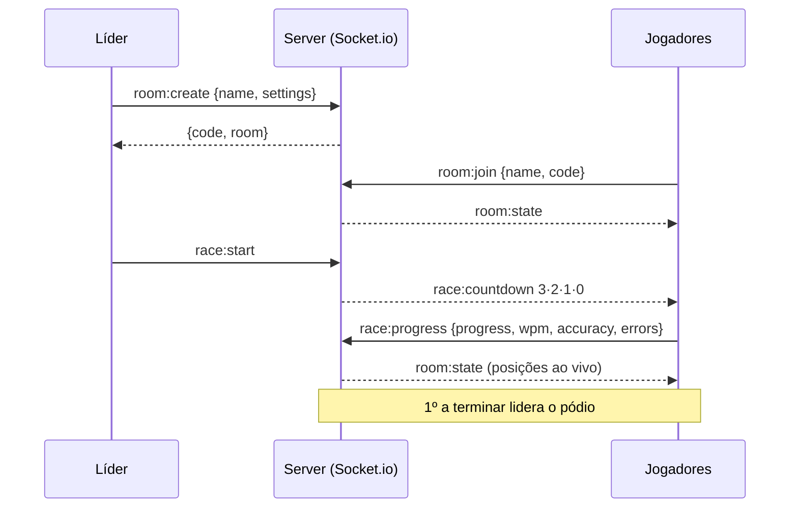

<div align="center">

# ⌨️ CodeRacer

### Corrida de digitação multiplayer para programadores: digite o código mais rápido e vença.
### Multiplayer typing race for programmers: type the code fastest and win.

[](https://nextjs.org/)
[](https://www.typescriptlang.org/)
[](https://socket.io/)
[](https://tailwindcss.com/)
[](https://nodejs.org/)

🇧🇷 [**Português**](#-português) · 🇺🇸 [**English**](#-english)

```
> _ CodeRacer
```

</div>

---

## 🇧🇷 Português
<a name="-português"></a>

### O que é

**CodeRacer** é uma **corrida de digitação multiplayer para programadores**. Você cria uma sala, manda o link pros amigos e quem digitar o snippet de código mais rápido (e com menos erro) vence. Sem cadastro, sem banco de dados, sem firula — as **salas vivem em memória** (reiniciou o servidor, somem; é proposital pro MVP). O visual é dark hacker, com `🚀` correndo numa pista em tempo real e até um fundo opcional de Matrix.

### Recursos

- 🏁 **Salas em tempo real** via Socket.io — código de 6 letras pra convidar.
- 💻 **7 linguagens** de snippet: JS/TS, Python, Java, C#, C++, Go, Rust — com dificuldade fácil/médio/difícil.
- 📊 **Métricas ao vivo:** WPM, precisão, erros e progresso por jogador; posição no topo, pista com `🚀`.
- 🏆 **Pódio** ao final; o líder pode reiniciar a partida.
- 💬 **Chat** na sala e fundo opcional **MatrixRain**.
- 🚫 **Paste desabilitado** no input (pra ser justo); backspace permitido mas só conta acerto forward.

### Como rodar

```bash
npm install
npm run dev        # http://localhost:3000 (Next + Socket.io na mesma porta via server.js)
```

Produção:

```bash
npm run build
npm start          # NODE_ENV=production node server.js
```

Variável opcional: `PORT=4000 npm run dev`. Scripts úteis: `npm run typecheck`, `npm run lint`.

### Como jogar

1. Na home, coloque seu nick.
2. **Criar sala** → escolha linguagem, dificuldade e máx. de jogadores.
3. Compartilhe o **código de 6 letras** (ou o link).
4. O líder clica em **Iniciar partida** → countdown 3·2·1·**GO!**.
5. Digite; posição em tempo real no topo, stats embaixo (WPM, precisão, erros, progresso).
6. Quem termina vai pro pódio; o líder pode reiniciar.

### Stack

- **Next.js 14** (App Router) + **TypeScript**
- **Tailwind CSS** + **Framer Motion** (visual dark hacker)
- **Socket.io** num **custom server Node** (`server.js`) — mesma porta do Next
- **Salas em memória** — zero banco de dados (proposital no MVP)
- Utilitários: `nanoid`, `clsx`, `tailwind-merge`, `lucide-react`

### Arquitetura

```
.
├── server.js                    # custom Next + Socket.io server
├── src/
│   ├── app/
│   │   ├── layout.tsx · page.tsx (home)
│   │   ├── room/[id]/page.tsx    # sala (lobby + race + results)
│   │   └── globals.css           # tema dark hacker
│   ├── components/
│   │   ├── HomeView · RoomView (orquestra estados)
│   │   ├── Lobby · Countdown · Race (digitação + métricas) · Results (pódio)
│   │   ├── RaceTrack (🚀 por jogador) · CodeDisplay (char-by-char)
│   │   ├── Chat · PlayerList · Logo · MatrixRain
│   │   └── ui/ (Modal, Toast)
│   └── lib/
│       ├── snippets-server.js    # snippets (CommonJS, consumido pelo server)
│       ├── languages.ts · types.ts · utils.ts · socket-client.ts
```

### Fluxo de uma partida



### Eventos Socket.io

**client → server:** `room:create`, `room:join`, `room:updateSettings`, `chat:send`, `race:start`, `race:progress`, `race:abandon`, `race:reset`.
**server → client:** `room:state` (RoomState completo), `race:countdown` (n = 3,2,1,0).

### Notas

- WPM = (caracteres corretos / 5) / minutos (padrão da indústria).
- Sala vazia some sozinha; se o líder sai, o próximo jogador vira líder.

### Próximos passos (ideias)

- Persistência opcional (Supabase / SQLite) pra histórico de partidas.
- Modo solo contra fantasmas (replay de partidas).
- Modo "code review" — corrigir bugs em vez de só digitar.
- Voice chat (WebRTC), mais snippets via PR da comunidade, tema claro.

---

## 🇺🇸 English
<a name="-english"></a>

### What it is

**CodeRacer** is a **multiplayer typing race for programmers**. Create a room, send the link to friends, and whoever types the code snippet fastest (with fewest errors) wins. No signup, no database, no fluff — **rooms live in memory** (restart the server and they vanish; intentional for the MVP). The look is dark-hacker, with `🚀` racing down a live track and an optional Matrix rain background.

### Features

- 🏁 **Real-time rooms** via Socket.io — 6-letter invite code.
- 💻 **7 snippet languages**: JS/TS, Python, Java, C#, C++, Go, Rust — easy/medium/hard.
- 📊 **Live metrics:** WPM, accuracy, errors, per-player progress; standings on top, `🚀` track.
- 🏆 **Podium** at the end; the leader can restart.
- 💬 In-room **chat** and optional **MatrixRain** background.
- 🚫 **Paste disabled** in the input (fairness); backspace allowed but only forward hits count.

### Run it

```bash
npm install
npm run dev        # http://localhost:3000 (Next + Socket.io same port via server.js)

npm run build && npm start   # production (NODE_ENV=production node server.js)
```

Optional: `PORT=4000 npm run dev`. Also: `npm run typecheck`, `npm run lint`.

### How to play

Enter a nick → **Create room** (pick language, difficulty, max players) → share the **6-letter code** → leader hits **Start** → 3·2·1·**GO!** → type; live standings on top, your stats below → finishers hit the podium; leader can restart.

### Stack

**Next.js 14** (App Router) + TypeScript · **Tailwind CSS** + Framer Motion · **Socket.io** on a **custom Node server** (`server.js`, same port as Next) · **in-memory rooms** (no DB). Helpers: `nanoid`, `clsx`, `tailwind-merge`, `lucide-react`. See the Portuguese section for the full architecture tree, message sequence and Socket.io event tables.

### Notes

- WPM = (correct chars / 5) / minutes (industry standard).
- Empty rooms auto-dispose; if the leader leaves, the next player becomes leader.

---

<div align="center">

*Parte do ecossistema de projetos de **Caio**.*

</div>
